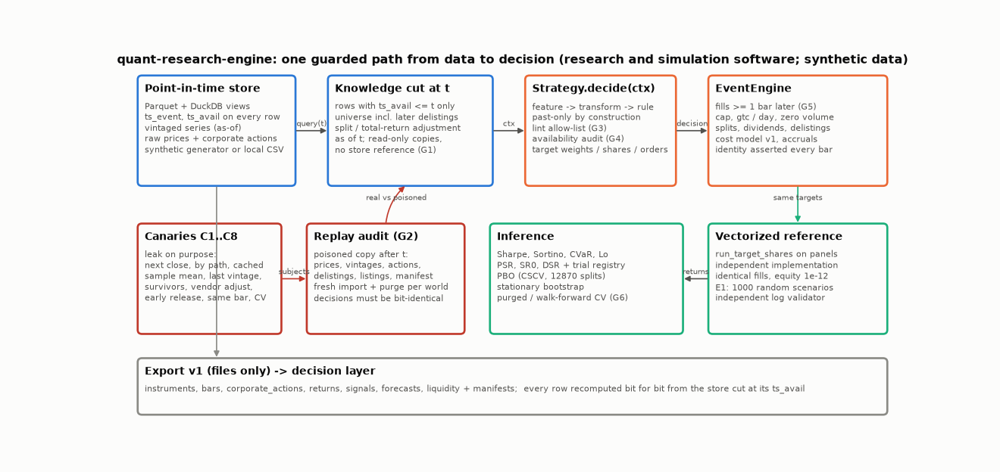
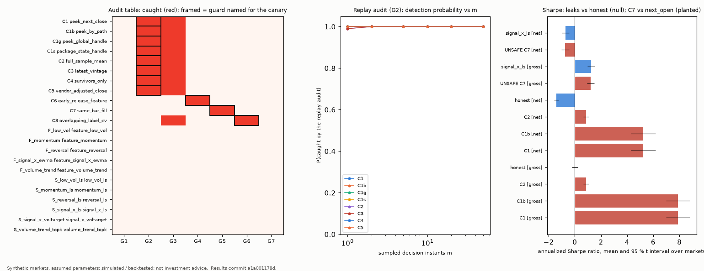
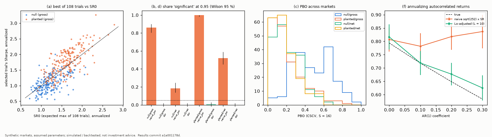
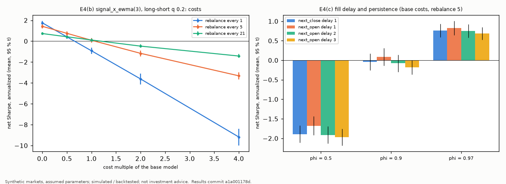
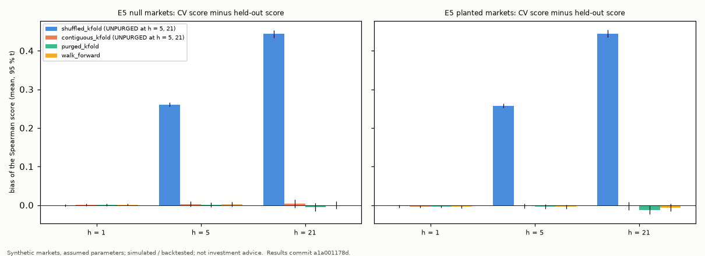
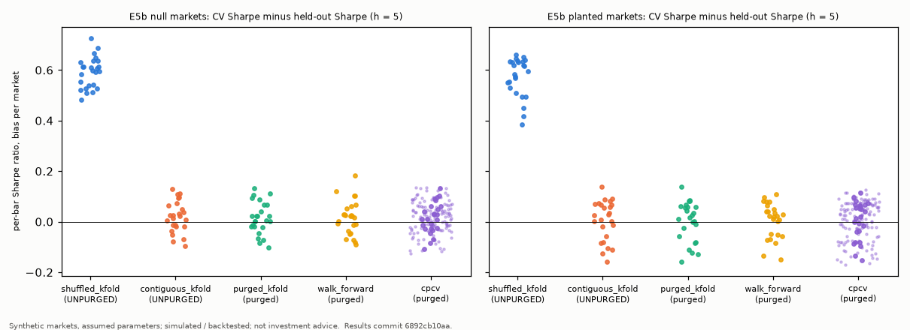
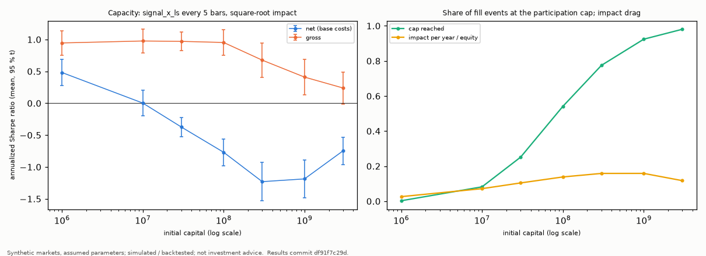

# Quant Research Engine

**Research and simulation software. Not investment advice. No live trading, no broker connectivity.**

**Synthetic data.** Every result below is simulated or backtested on synthetic markets with assumed parameters ([docs/data.md](docs/data.md)); they show how the machinery behaves *in this simulation, under these assumptions* and say nothing about real markets, profitability, or alpha.

A point-in-time research engine built to make look-ahead hard to commit by accident and to keep backtest statistics honest: one guarded data path from a Parquet store to a strategy, a replay audit that tries to catch strategies that cheat, an event-driven engine checked against an independent vectorized engine with exact accounting, and inference tools that correct for selection (probabilistic and deflated Sharpe ratio, probability of backtest overfitting, purged validation), calibrated on markets where the truth is known.

**Status:** Tier 1 is complete and evaluated: the checks pass, and the full evaluation (E1 to E5) ran once on commit `a1a0011`. Tier 2 items 1 to 4 are done, each run once on its own commit (CPCV comparison, real-data adapters with one illustration, capacity, effective number of trials). Items 5 to 8 are not started; see [TODO](#todo).



## What this project is not

Not a factor library, not a trading system, not a data vendor, and not investment advice. It makes no claim about profitability or real markets. The hand-off to the decision layer (`dynamic-trading-engine`) is a set of files (export v1: returns, signals, forecasts, liquidity inputs); the decision layer needs no code from this repository and estimates its own risk models.

## Available now

- **Point-in-time store** (Parquet, DuckDB views): `ts_event` and `ts_avail` on every row, vintaged series with revisions (as-of queries, also as a DuckDB `ASOF JOIN`), raw prices with splits and dividends applied as of the decision instant, a universe that includes names that later delist, calendars, a local-CSV adapter.
- **`DecisionContext`**, the only data path to a strategy: read-only copies of the rows known at the decision instant, no store reference. Guards G1 to G7 and eleven canaries (below).
- **Two engines**: `EventEngine` (fills at the next open or close, fill delays, participation cap with `gtc`/`day` orders, zero-volume bars, shorts, leverage limit, splits, dividends, delistings) and the vectorized `run_target_shares`; one cost model (spread, square-root impact, commission, borrow, financing); the accounting identity asserted on every bar; an independent validator that re-derives the accounting from the logs; attribution by instrument and by long and short book.
- **Features, signals, portfolio rules, strategies**: `momentum`, `reversal`, `low_vol`, `volume_trend`, `signal_x_ewma` (context and panel implementations), `zscore`/`rank`/`winsorize`, `long_short_quantile`, `long_only_topk`, `vol_target`; built-in strategies `momentum_ls`, `reversal_ls`, `low_vol_ls`, `signal_x_ls`, `volume_trend_topk`, `signal_x_voltarget`.
- **Metrics and inference**: Sharpe, Sortino, drawdown, Calmar, CVaR, hit rate, moments, Lo's autocorrelation adjustment, PSR, SR0, DSR with a trial registry, PBO by CSCV, the stationary bootstrap, purged K-fold with embargo, walk-forward, CPCV ([docs/inference.md](docs/inference.md)).
- **Synthetic market generator** with a planted, known predictability, null settings, events, regimes, Student-t tails, and distribution shift.
- **Experiments E1 to E5** and the **Tier 2 experiments** E5b (CPCV), `t2_capacity`, and `t2_trials`: one command, quick mode, manifests, byte-identical results for the same configuration and seed on one platform with the same package versions (across platforms they agree numerically, not byte for byte: [reproducibility across platforms](experiments/README.md#reproducibility-across-platforms)). Also **export v1** with a validator, a **report** generator, and figures from committed results.
- **Third-party adapters** (Tier 2): the Kenneth French Data Library (one labelled illustration) and Binance daily klines (offline fixture only); both are tested offline.

## Results (synthetic, assumed parameters)

Every number in this section comes from the full evaluation, run once on commit `a1a0011` with a clean tree (`python -m quant_research_engine experiment run --workers 2`). The results are in `experiments/results/<experiment>/`, each with a manifest, and `scripts/make_tables.py` turns them into these tables. The markets are synthetic, with the assumed parameters of [docs/data.md](docs/data.md), so every statement holds only in this simulation, under these assumptions. Intervals are 95 % Student-t intervals across markets or seeds, written as mean ± half-width. Shares carry 95 % Wilson intervals, written [low, high] in percent. The protocol, the grids, and the rule for what this section shows were frozen before the evaluation ([experiments/README.md](experiments/README.md#protocol)).

### E1: engine and accounting audit (1000 random scenarios)

Seeds 3000 to 3999 (`experiments/results/e1/aggregates.json`). Each scenario is a small synthetic store of 2 to 12 instruments by 50 to 300 bars with a random target-share schedule. Both engines run it, and the independent validator re-derives the fills and the accounting from the logs.

| Measure | Value |
|---|---|
| scenarios (compared / excluded: cap binding or rejected order) | 1000 (956 / 44) |
| fill mismatches between the engines | 0 |
| largest relative difference of fill quantity, reference price, price, spread, impact, commission | 0, 0, 0, 0, 0, 0 |
| largest relative difference of equity | 2.1e-14 |
| largest accounting-identity residual (event / vector), relative to equity | 2.1e-15 / 1.8e-15 |
| independent validator failures (event logs / vector logs) | 0 / 0 |
| largest relative error found by the validator | 2.0e-14 |
| scenarios with splits / dividends / delistings / late listings / zero-volume bars / lot sizes | 981 / 996 / 861 / 862 / 999 / 996 |
| fill delay 1 / 2 / 3 bars; shorts on | 307 / 323 / 370; 614 |
| violations | 0 |

The engines are meant to agree only where neither the participation cap nor a rejection applies, so the 44 scenarios where one of those happened were left out of the engine comparison. Their event-engine logs were still validated, and the identity residuals above include them.

### E2: leakage audit

Every guard ran on every canary and on every built-in strategy and feature. The audit used 10 `small` stores (seeds 4100 to 4109) and sampled 10 decision instants per store, so each subject was checked at 100 instants (`experiments/results/e2/audit_table.csv`). "Guard named" is the guard each canary was written for, fixed in the plan before the evaluation.

| Subject | Kind | Guard named | G1 | G2 | G3 | G4 | G5 | G6 | G7 | G2 instants caught |
|---|---|---|---|---|---|---|---|---|---|---|
| C1 peek_next_close | strategy | G2 | passed | **caught** | **caught** | passed | passed | passed | passed | 100 / 100 |
| C1b peek_by_path | strategy | G2 | passed | **caught** | **caught** | passed | passed | passed | passed | 100 / 100 |
| C1g peek_global_handle | strategy | G2 | passed | **caught** | **caught** | passed | passed | passed | passed | 100 / 100 |
| C1s package_state_handle | strategy | G2 | passed | **caught** | **caught** | passed | passed | passed | passed | 100 / 100 |
| C2 full_sample_mean | strategy | G2 | passed | **caught** | **caught** | passed | passed | passed | passed | 99 / 100 |
| C3 latest_vintage | strategy | G2 | passed | **caught** | **caught** | passed | passed | passed | passed | 99 / 100 |
| C4 survivors_only | strategy | G2 | passed | **caught** | **caught** | passed | passed | passed | passed | 100 / 100 |
| C5 vendor_adjusted_close | strategy | G2 | passed | **caught** | **caught** | passed | passed | passed | passed | 99 / 100 |
| C6 early_release_feature | feature | G4 | passed | passed | passed | **caught** | passed | passed | passed | 0 / 100 |
| C7 same_bar_fill | run | G5 | passed | passed | passed | passed | **caught** | passed | passed | 0 / 100 |
| C8 overlapping_label_cv | cv | G6 | passed | passed | **caught** | passed | passed | **caught** | passed | 0 / 100 |
| F_low_vol feature_low_vol | feature | - | passed | passed | passed | passed | passed | passed | passed | 0 / 100 |
| F_momentum feature_momentum | feature | - | passed | passed | passed | passed | passed | passed | passed | 0 / 100 |
| F_reversal feature_reversal | feature | - | passed | passed | passed | passed | passed | passed | passed | 0 / 100 |
| F_signal_x_ewma feature_signal_x_ewma | feature | - | passed | passed | passed | passed | passed | passed | passed | 0 / 100 |
| F_volume_trend feature_volume_trend | feature | - | passed | passed | passed | passed | passed | passed | passed | 0 / 100 |
| S_low_vol_ls low_vol_ls | strategy | - | passed | passed | passed | passed | passed | passed | passed | 0 / 100 |
| S_momentum_ls momentum_ls | strategy | - | passed | passed | passed | passed | passed | passed | passed | 0 / 100 |
| S_reversal_ls reversal_ls | strategy | - | passed | passed | passed | passed | passed | passed | passed | 0 / 100 |
| S_signal_x_ls signal_x_ls | strategy | - | passed | passed | passed | passed | passed | passed | passed | 0 / 100 |
| S_signal_x_voltarget signal_x_voltarget | strategy | - | passed | passed | passed | passed | passed | passed | passed | 0 / 100 |
| S_volume_trend_topk volume_trend_topk | strategy | - | passed | passed | passed | passed | passed | passed | passed | 0 / 100 |

- Every canary was caught by its named guard. No built-in strategy or feature raised an alarm.
- The lint (G3) also flags C1 to C5 and C8. Each imports a module that the allow-list forbids (`os`, the canaries' helper modules, or the splitters), and canaries are exempt from the lint's enforcement ([docs/lookahead.md](docs/lookahead.md)).
- The replay audit (G2) flagged C1, C1b, C1g, C1s, and C4 at all 100 instants, and C2, C3, and C5 at 99 of 100.
- G2 did not flag C6, C7, or C8. Their leaks are in a feature's declared availability, a fill rule, and a validation scheme, and G4, G5, and G6 caught them.

The next table gives the detection probability of the replay audit when only m instants are sampled, from 100 random draws of m out of the 100 audited instants (`detection.csv`):

| Canary | m = 1 | m = 2 | m = 5 | m = 10 | m = 20 | m = 50 |
|---|---|---|---|---|---|---|
| C1 | 1.00 | 1.00 | 1.00 | 1.00 | 1.00 | 1.00 |
| C1b | 1.00 | 1.00 | 1.00 | 1.00 | 1.00 | 1.00 |
| C1g | 1.00 | 1.00 | 1.00 | 1.00 | 1.00 | 1.00 |
| C1s | 1.00 | 1.00 | 1.00 | 1.00 | 1.00 | 1.00 |
| C2 | 0.99 | 1.00 | 1.00 | 1.00 | 1.00 | 1.00 |
| C3 | 0.99 | 1.00 | 1.00 | 1.00 | 1.00 | 1.00 |
| C4 | 1.00 | 1.00 | 1.00 | 1.00 | 1.00 | 1.00 |
| C5 | 1.00 | 1.00 | 1.00 | 1.00 | 1.00 | 1.00 |

The leaks that pay on a null market (C1, C1b, C2) were compared with an honest past-only rule on 10 `null_e3` markets of 60 instruments by 1260 bars (seeds 4000 to 4009). On those markets the honest rule's true Sharpe ratio is zero.
- The honest rule is the one-feature momentum(21, 5) strategy with a decision every bar. It uses the same weighting as C1 and C1b; C2 holds all of its weight in one instrument.
- Runs use the event engine with equity sizing.
- The gross panel (all costs zero) is the comparison. The net panel (base cost model) is shown beside it, labelled.

C7 was compared with the same strategy filled at `next_open` on 10 `planted` markets (seeds 4200 to 4209) and is labelled UNSAFE (`sharpe_aggregates.csv`):

| Part | Panel | Subject | Annualized Sharpe (mean ± 95 % t) | Paired difference vs reference | Markets |
|---|---|---|---|---|---|
| sharpe | gross | C1 | 7.89 ± 0.90 | 7.89 ± 0.86 | 10 |
| sharpe | gross | C1b | 7.89 ± 0.90 | 7.89 ± 0.86 | 10 |
| sharpe | gross | C2 | 0.86 ± 0.20 | 0.86 ± 0.23 | 10 |
| sharpe | gross | honest | 0.00 ± 0.23 | 0.00 ± 0.00 | 10 |
| sharpe | net | C1 | 5.23 ± 0.95 | 6.65 ± 0.89 | 10 |
| sharpe | net | C1b | 5.23 ± 0.95 | 6.65 ± 0.89 | 10 |
| sharpe | net | C2 | 0.86 ± 0.20 | 2.28 ± 0.20 | 10 |
| sharpe | net | honest | -1.42 ± 0.17 | 0.00 ± 0.00 | 10 |
| c7 | gross | UNSAFE C7 | 1.20 ± 0.27 | -0.04 ± 0.11 | 10 |
| c7 | gross | signal_x_ls | 1.24 ± 0.27 | 0.00 ± 0.00 | 10 |
| c7 | net | UNSAFE C7 | -0.74 ± 0.30 | -0.03 ± 0.10 | 10 |
| c7 | net | signal_x_ls | -0.71 ± 0.29 | 0.00 ± 0.00 | 10 |

| Panel | Per-market ratio of Sharpe ratios, C7 / next_open (mean ± 95 % t) | Ratio of mean Sharpe ratios |
|---|---|---|
| gross | 0.97 ± 0.09 | 0.97 |
| net | 1.02 ± 0.16 | 1.04 |

- C1 and C1b tie exactly in every market and panel: their decisions are identical.
- At zero costs the leaks reached annualized Sharpe ratios of 7.89 ± 0.90 (C1, C1b) and 0.86 ± 0.20 (C2), against 0.00 ± 0.23 for the honest rule.
- The UNSAFE same-bar fill (C7) did not change the Sharpe ratio of `signal_x_ls` measurably in this market: the per-market ratio was 0.97 ± 0.09 gross and 1.02 ± 0.16 net, and both intervals contain 1.
  - The expected gap is small. With persistence 0.9 and an overnight share of 0.25, a next-open fill should miss about 0.25 × (1 − 0.9) = 2.5 % of the planted per-bar mean (E4(a) is consistent with this relation: 0.1901, se 0.0045, against 0.1950), and 10 markets cannot resolve a difference that size.
  - G5 refuses such a run whatever it earns.
- C8 is measured by the shuffled-fold row of E5.



### E3: calibration of the inference tools (200 null and 200 planted markets)

108 trials (18 signals × 2 portfolio rules × 3 rebalance intervals) ran on two sets of markets, each 60 instruments by 1260 bars:
- 200 `null_e3` markets (seeds 1000 to 1199), where every trial's true Sharpe ratio is zero in the gross panel;
- 200 `planted` markets (seeds 2000 to 2199).

Runs use the vectorized engine with fixed capital, and on each market the in-sample best trial is "selected" (`experiments/results/e3/aggregates.csv`). Gross means all costs are zero; this panel is the calibration. The net panel (base costs) is labelled. There the trials' true Sharpe ratios are negative and differ with turnover, so SR0, PSR, and DSR do not describe a null, and the net rows only show what gets selected and what the PBO says.

| Market / panel | Selected trial's per-bar Sharpe | SR0 (N = 108) | Selected / SR0 | Naive PSR(0) > 0.95 | DSR > 0.95 | Mean PBO | Selected trial uses signal_x |
|---|---|---|---|---|---|---|---|
| null / gross | 0.0692 ± 0.0024 | 0.0769 ± 0.0024 | 0.91 ± 0.03 | 86.0 % [80.5, 90.1] | 0.0 % [0.0, 1.9] | 0.48 ± 0.03 | 21.5 % [16.4, 27.7] |
| null / net | 0.0328 ± 0.0030 | 0.3291 ± 0.0072 | 0.10 ± 0.01 | 18.5 % [13.7, 24.5] | 0.0 % [0.0, 1.9] | 0.21 ± 0.02 | 19.5 % [14.6, 25.5] |
| planted / gross | 0.1118 ± 0.0036 | 0.1027 ± 0.0028 | 1.10 ± 0.03 | 100.0 % [98.1, 100.0] | 0.5 % [0.1, 2.8] | 0.20 ± 0.02 | 88.5 % [83.3, 92.2] |
| planted / net | 0.0561 ± 0.0034 | 0.3142 ± 0.0071 | 0.18 ± 0.01 | 52.0 % [45.1, 58.8] | 0.0 % [0.0, 1.9] | 0.18 ± 0.02 | 69.5 % [62.8, 75.5] |

- **Null markets, gross.** The naive PSR(0) of the selected trial exceeded 0.95 in 86.0 % [80.5, 90.1] of the markets, where a nominal 5 % test would give 5 %. The DSR over the 108 registered trials never exceeded 0.95 (0.0 % [0.0, 1.9]). The mean PBO was 0.48 ± 0.03.
- **SR0 and correlated trials.** SR0 assumes 108 independent trials, but these trials are correlated: the same signals appear at three rebalance intervals and under two rules. On null markets the selected Sharpe ratio averaged 0.91 ± 0.03 of SR0, so SR0 was above the observed maximum. A larger SR0 lowers every DSR, so the DSR rejected less often than it would with an SR0 that matched the observed maximum.
- **Planted markets, gross.** The selected trial used `signal_x` in 88.5 % [83.3, 92.2] of the markets, and the mean PBO was 0.20 ± 0.02. Even so, the DSR exceeded 0.95 in only 1 market of 200 (0.5 % [0.1, 2.8]). In this simulation the DSR with N = 108 had almost no power against this planted signal.
- **Bootstrap coverage.** The 95 % stationary-bootstrap interval of the Sharpe ratio contained the true value of zero in 37.5 % [31.1, 44.4] of null markets for the selected trial. For a trial fixed in advance it did so in 95.0 % [91.0, 97.3] (`selected.csv`).
- **Lo adjustment.** On AR(1) returns (200 series of 2520 bars per coefficient, `lo.csv`), at coefficient 0.3 the naive annualization gave 0.84 ± 0.06 and the adjusted one 0.63 ± 0.05, against a true 0.58. Full table: [docs/inference.md](docs/inference.md#calibration-on-synthetic-markets-e3).



### E4: signal recovery, costs, and lag (100 instruments by 2520 bars, 20 seeds)

Seeds 5000 to 5019 (`experiments/results/e4/`).

**(a) Recovery on `planted_clean` markets** (no factors, equal volatilities, no regimes or events; `aggregates.json`):

| Quantity | Measured | Expected |
|---|---|---|
| Information coefficient of the latent signal (an oracle) | 0.0196 ± 0.0011 | 0.02 (configured) |
| Information coefficient of `signal_x` | 0.0138 ± 0.0011 | 0.0141 |
| Per-bar Sharpe ratio, fundamental-law weights held close to close (a bound no engine can reach) | 0.1962 (se 0.0045) | 0.2 |
| Per-bar Sharpe ratio, same weights through the event engine, next-open fills, zero costs (an oracle) | 0.1901 (se 0.0045) | 0.1950 |

**(b) Costs.** The strategy is `signal_x_ewma(3)` with `long_short_quantile(0.2, equal)` on `planted` markets, using the vectorized engine with fixed capital. The table gives the annualized net Sharpe ratio by rebalance interval and multiple of the base cost model (`costs.csv`). The break-even multiple comes from linear interpolation of the mean net Sharpe curve. The base case, fixed in advance, is in bold.

| Rebalance / cost multiple | 0.0 | 0.5 | 1.0 | 2.0 | 4.0 | Break-even multiple |
|---|---|---|---|---|---|---|
| every 1 | 1.76 ± 0.17 | 0.42 ± 0.21 | -0.92 ± 0.30 | -3.62 ± 0.51 | -9.18 ± 0.80 | 0.66 |
| every 5 | 1.42 ± 0.19 | 0.75 ± 0.20 | **0.09 ± 0.22** | -1.17 ± 0.28 | -3.32 ± 0.35 | 1.07 |
| every 21 | 0.73 ± 0.12 | 0.42 ± 0.13 | 0.11 ± 0.14 | -0.47 ± 0.16 | -1.42 ± 0.18 | 1.19 |

| Rebalance every | Gross Sharpe | Net Sharpe at base costs |
|---|---|---|
| 1 bar | 1.76 ± 0.17 | −0.92 ± 0.30 |
| 5 bars | 1.42 ± 0.19 | 0.09 ± 0.22 |
| 21 bars | 0.73 ± 0.12 | 0.11 ± 0.14 |

At the base costs, costs took most or all of the gross Sharpe ratio at every rebalance interval in this simulation.

**(c) Fill delay and signal persistence:** see [experiments/README.md](experiments/README.md#e4-signal-recovery-costs-and-lag).



### E5: validation schemes against a held-out segment (50 null and 50 planted markets)

The markets are 60 instruments by 1533 bars (seeds 6000 to 6049 and 7000 to 7049).
- **Model:** a k-nearest-neighbour model written in NumPy (k = 25, per instrument) predicts the forward return over h bars.
- **Scores:** each scheme's cross-validation score (Spearman correlation, K = 5) is compared with the score on a held-out segment of 252 bars after a gap of 21 (`experiments/results/e5/aggregates.csv`).
- **Bias:** the cross-validation score minus the held-out score.

The table shows the bias at h = 5, chosen in advance. The full table for h = 1, 5, and 21 is in [experiments/README.md](experiments/README.md#e5-validation-schemes).

| Scheme (h = 5) | Label | Bias, null markets | Bias, planted markets |
|---|---|---|---|
| shuffled_kfold | UNPURGED | 0.260 ± 0.005 | 0.258 ± 0.005 |
| contiguous_kfold | UNPURGED | 0.003 ± 0.006 | -0.002 ± 0.006 |
| purged_kfold | purged | 0.001 ± 0.006 | -0.004 ± 0.006 |
| walk_forward | purged | 0.002 ± 0.006 | -0.004 ± 0.005 |

- Shuffled K-fold on overlapping labels overstated the held-out score by about 0.26 at h = 5 and 0.44 at h = 21, on null and planted markets alike. On null markets this is the measure of canary C8.
- At h = 1, where labels do not overlap, the shuffled bias was between −0.003 and 0.000.
- Contiguous K-fold without purge, purged K-fold, and walk-forward had mean biases between −0.013 and +0.004 at every h. Some of these small negative biases on planted markets have intervals that exclude zero, for example purged K-fold at h = 21 (−0.013 ± 0.011).



## Tier 2 results

Each Tier 2 experiment ran once, on the commit named in its heading, and adds its own files under `experiments/results/`. Every later commit that changed result-affecting code reproduced the E1 to E5 quick results of the evaluation commit byte for byte on the build machine (Windows 11, Python 3.12.3, the package versions in the manifests); this was checked on `6892cb1`, `df91f7c`, and `d26a863` against the fingerprint in `experiments/quick-hashes-a1a0011.txt` (`scripts/quick_hashes.py`), and `0ea0e9b` changed no result-affecting code. Unless a heading says otherwise, the markets are synthetic and every statement holds only in this simulation, under these assumptions.

### E5b: CPCV in the comparison of validation schemes (commit `6892cb1`)

E5b uses the model, features, and labels of E5 (h = 5) on markets of its own: 25 `null` markets (seeds 8000 to 8024) and 25 `planted` markets (seeds 9000 to 9024), each 60 × 1533 (`experiments/results/e5b/`).
- **Schemes:** the four schemes of E5, plus combinatorial purged CV (CPCV) with 6 groups and 2 test groups (15 splits, 5 backtest paths, purge and embargo h).
- **Measures:** each scheme's Spearman score, as in E5, and the per-bar Sharpe ratio of a prediction-ranked long-short portfolio held one bar with no costs. Each is compared with the same measure on the held-out segment.
- **CPCV estimate:** a market's CPCV estimate is the mean over its 5 paths.

| Market | Scheme | Label | Spearman: bias (mean ± 95 % t) | sd of the bias | mean abs. bias | Sharpe per bar: bias (mean ± 95 % t) | sd of the bias | mean abs. bias | sd over CPCV paths within a market (Spearman / Sharpe) |
|---|---|---|---|---|---|---|---|---|---|
| null | shuffled_kfold | UNPURGED | 0.257 ± 0.007 | 0.018 | 0.257 | 0.591 ± 0.025 | 0.061 | 0.591 | – |
| null | contiguous_kfold | UNPURGED | -0.001 ± 0.008 | 0.020 | 0.016 | 0.020 ± 0.026 | 0.062 | 0.052 | – |
| null | purged_kfold | purged | -0.003 ± 0.008 | 0.020 | 0.016 | 0.014 ± 0.026 | 0.063 | 0.049 | – |
| null | walk_forward | purged | 0.000 ± 0.008 | 0.020 | 0.016 | 0.016 ± 0.028 | 0.067 | 0.053 | – |
| null | cpcv | purged | -0.003 ± 0.008 | 0.020 | 0.017 | 0.016 ± 0.025 | 0.061 | 0.051 | 0.005 / 0.016 |
| planted | shuffled_kfold | UNPURGED | 0.253 ± 0.009 | 0.021 | 0.253 | 0.573 ± 0.032 | 0.077 | 0.573 | – |
| planted | contiguous_kfold | UNPURGED | -0.006 ± 0.009 | 0.022 | 0.017 | 0.005 ± 0.033 | 0.080 | 0.066 | – |
| planted | purged_kfold | purged | -0.008 ± 0.009 | 0.021 | 0.017 | 0.002 ± 0.032 | 0.079 | 0.064 | – |
| planted | walk_forward | purged | -0.005 ± 0.008 | 0.020 | 0.016 | 0.005 ± 0.029 | 0.070 | 0.058 | – |
| planted | cpcv | purged | -0.006 ± 0.008 | 0.021 | 0.017 | 0.005 ± 0.031 | 0.075 | 0.063 | 0.005 / 0.017 |

- **Shuffled K-fold** overstated both measures, as in E5: by 0.257 in Spearman score and 0.591 in per-bar Sharpe ratio on null markets.
- **The four purged or contiguous schemes could not be told apart in this run.** Their mean biases all have intervals that contain zero, and their spreads of the bias across markets differ by at most 0.002 (Spearman) and 0.010 (Sharpe).
- **"Closest" and "noisiest" are near-ties, not findings.** The table below lists, for completeness, the scheme with the smallest mean absolute bias and the one with the largest spread. Among the four schemes, mean absolute biases differ by at most 0.002 (Spearman) and 0.008 (Sharpe), and spreads by at most 0.002 and 0.010. Both gaps are small next to the spread of the bias across markets (about 0.02 in Spearman score and 0.06 to 0.08 in Sharpe ratio).
- **Path and market variation.** Within a market, the 5 CPCV paths varied much less (sd 0.005 Spearman, 0.016 to 0.017 Sharpe) than the bias varied across markets (sd 0.020 to 0.021 Spearman, 0.061 to 0.075 Sharpe).

| Market, measure | Smallest mean absolute bias | Largest sd of the bias |
|---|---|---|
| null_h5_sharpe | purged_kfold | walk_forward |
| null_h5_spearman | walk_forward | purged_kfold |
| planted_h5_sharpe | walk_forward | contiguous_kfold |
| planted_h5_spearman | walk_forward | contiguous_kfold |



### Real-data adapters (commit `0ea0e9b`): Kenneth French illustration, no claims

- **Kenneth R. French Data Library.** The adapter turns a daily portfolio file into a return-index store. The file has no open and no volume, so fills are at `next_close` and impact is off. One illustration ran:
  - **Data:** the 49 industry portfolios, value-weighted daily returns from 2000-01-03 to 2026-08-31. The file is downloaded once to the git-ignored `data/cache/` and never committed. It is the library's latest vintage and is not point-in-time, and each return becomes known one day after its close.
  - **Terms:** copyright Eugene F. Fama and Kenneth R. French; the file says it was built from the CRSP database. No terms of use were found ([docs/data.md](docs/data.md#third-party-sources-tier-2-adapters)).
  - **Run:** the built-in `momentum_ls`, rebalanced every 21 bars, through the event engine with equity sizing, base spread and commission, and one trial fixed before the data was read (`python scripts/illustrate_french.py`, `experiments/results/t2_french/summary.json`).
- **Binance daily klines.** The adapter is tested on an offline fixture only. Nothing was downloaded, because the archive's terms need the owner's acceptance.
- **SEC `companyfacts`.** Skipped, because `QRE_SEC_USER_AGENT` was not set.

| Illustration, no claims | Value |
|---|---|
| net daily returns after the warmup | 6674 |
| net / gross annualized Sharpe ratio | 0.15 / 0.25 |
| PSR(0) of the net returns (one trial) | 0.78 |
| maximum drawdown | 19.4 % |
| fills; largest accounting-identity residual | 8992; 8.7e-16 |

These numbers show only that the adapter and the engine run on such a file with the accounting identity intact. One strategy, one period, and a revised data vintage say nothing about momentum or about markets.

### Capacity and impact (commit `df91f7c`)

The built-in `signal_x_ls` was run through the event engine on 10 `planted` markets of 60 × 1260 (seeds 10000 to 10009, `experiments/results/t2_capacity/`) at seven initial capitals from 1 million to 3 billion.
- **Run:** rebalanced every 5 bars, with equity sizing and the base cost model, which includes square-root impact and a participation cap of the contract's default.
- **Gross:** before every cost, dividends included.
- **"At the participation cap":** the share of fill events (an instrument and a bar with a fill) whose fills reached the cap.

| Initial capital | Net Sharpe (ann.) | Gross Sharpe (ann.) | Impact per year / equity | All costs per year / equity | Fill events at the participation cap |
|---|---|---|---|---|---|
| 1e+06 | 0.48 ± 0.20 | 0.95 ± 0.19 | 0.026 ± 0.004 | 0.042 ± 0.004 | 0.003 ± 0.004 |
| 1e+07 | 0.00 ± 0.20 | 0.98 ± 0.18 | 0.072 ± 0.008 | 0.087 ± 0.008 | 0.082 ± 0.037 |
| 3e+07 | -0.37 ± 0.15 | 0.97 ± 0.15 | 0.104 ± 0.009 | 0.120 ± 0.009 | 0.251 ± 0.059 |
| 1e+08 | -0.77 ± 0.21 | 0.95 ± 0.20 | 0.139 ± 0.009 | 0.154 ± 0.009 | 0.541 ± 0.053 |
| 3e+08 | -1.23 ± 0.30 | 0.68 ± 0.27 | 0.159 ± 0.008 | 0.174 ± 0.008 | 0.775 ± 0.025 |
| 1e+09 | -1.19 ± 0.30 | 0.41 ± 0.28 | 0.159 ± 0.008 | 0.173 ± 0.009 | 0.924 ± 0.013 |
| 3e+09 | -0.75 ± 0.22 | 0.24 ± 0.25 | 0.117 ± 0.012 | 0.129 ± 0.013 | 0.981 ± 0.005 |

| Capacity (log-linear interpolation of the mean net Sharpe ratio; first crossing) | Capital |
|---|---|
| mean net Sharpe ratio at the smallest capital | 0.48 |
| capital at which it falls to half | 3.18e+06 |
| capital at which it falls to zero | 1.01e+07 |

- **Net Sharpe ratio falls fast with capital.** The mean net Sharpe ratio fell from 0.48 ± 0.20 at 1 million to 0.00 ± 0.20 at 10 million, and was negative from 30 million on. The half point interpolates between 1 million and 10 million. The zero point interpolates between 10 million and 30 million, because the mean at 10 million was still +0.003.
- **Gross Sharpe ratio holds, then falls.** It stayed between 0.95 and 0.98 up to 100 million and then fell. Over the same range the cap was reached more often: at 54 % of fill events at 100 million and at 98 % at 3 billion. No run with the cap off isolates the cause.
- **Neither impact nor the net Sharpe ratio moves in one direction with capital.** Impact per unit of equity peaked at 300 million to 1 billion and then fell. The net Sharpe ratio was less negative at 3 billion than at 300 million.

The capacity numbers belong to this strategy, this cost model, and these synthetic volumes, and say nothing about any real market.



### Effective number of trials and multiple testing (commit `d26a863`)

This experiment reuses the 400 markets of E3 (the same seeds and market streams; gross panel, the 108 trials; `experiments/results/t2_trials/`). It compares five rules for "the selected strategy is significant".
- **Rules:**
  - the naive PSR(0) and the DSR with N = 108, as in E3;
  - the DSR with N = N_eff rounded to an integer, where N_eff is the eigenvalue participation ratio (Σλ)² / Σλ² of the correlation matrix of the 108 trials' returns (V stays the variance over all 108);
  - Holm's step-down and Benjamini-Hochberg's step-up procedures at 0.05 on the per-trial p-values 1 − PSR(0).
- **Scoring:** on null markets every discovery is a false positive. On planted markets a discovery counts as power when it involves `signal_x`: for Holm and Benjamini-Hochberg a rejected `signal_x` trial, for the PSR and DSR rules a selected `signal_x` trial.
- **Check against E3:** the N = 108 DSR and naive PSR rows reproduce E3's committed decisions on all 400 markets.

| Rule | Null markets: share with a discovery (false positive) | Planted markets: share with a discovery involving signal_x (power) |
|---|---|---|
| naive PSR(0) > 0.95 | 86.0 % [80.5, 90.1] | 88.5 % [83.3, 92.2] |
| DSR, N = 108, > 0.95 | 0.0 % [0.0, 1.9] | 0.5 % [0.1, 2.8] |
| DSR, N = round(N_eff), > 0.95 | 2.0 % [0.8, 5.0] | 40.0 % [33.5, 46.9] |
| Holm, 0.05 | 3.0 % [1.4, 6.4] | 57.5 % [50.6, 64.1] |
| Benjamini-Hochberg, 0.05 | 3.5 % [1.7, 7.0] | 63.5 % [56.6, 69.9] |

- **N_eff** averaged 11.0, between 10.1 and 11.9, out of 108 registered trials.
- **DSR with N_eff.** Its false-positive rate stayed low (2.0 % [0.8, 5.0]), and its power on planted markets rose from 0.5 % (N = 108) to 40.0 % [33.5, 46.9].
- **Holm and Benjamini-Hochberg.** On null markets they made a discovery in 3.0 % and 3.5 % of markets, against a nominal 5 %. On planted markets they made a discovery involving `signal_x` in 57.5 % and 63.5 %.
- **Assumptions behind the p-values.** The per-trial p-values ignore the dependence between trials: Holm's guarantee holds under any dependence, while Benjamini-Hochberg's assumes independence or positive dependence.
- **Scope.** N_eff here is one eigenvalue-based count, not a clustering. These rates describe this trial grid on these synthetic markets, under these assumptions.

## Look-ahead guards and canaries

The context hands a strategy only copies of rows known at the decision instant (G1). The replay audit (G2) replays a strategy from its first decision to each sampled instant in the real store and in a copy poisoned after that instant (prices, volumes, vintages, corporate actions, delistings, listings, manifest); decisions must be bit-identical, and each world re-imports the strategy and every module that was imported after the audit started or lives in the subjects' directories (standard library, third-party packages, and this package excepted). It points every `open_store` call at its own store and checks that the package's own module and class state did not change. Handles memoized in helper modules, opened through `open_store` with a path, or parked in the package therefore come from the replayed world or are reported. A store read through `read_store(path)` is not redirected; there only the lint stands in the way. G3 is an import allow-list lint, G4 an availability audit of features, G5 refuses same-bar fills unless an explicit `unsafe_same_bar_fill` labels the run `UNSAFE`, G6 refuses splitters whose training labels overlap test labels, G7 checks the universe. The canaries leak on purpose: C1 (next close through a memoized handle), C1b (through `open_store` with a path; the E2 audit runs it without one, a self-test with the real store's path), C1g (module-global handle), C1s (a handle parked on a class of this package), C2 (full-sample mean cached in a constructor), C3 (last vintage), C4 (survivors only), C5 (vendor-adjusted prices), C6 (early-release feature), C7 (same-bar fill), C8 (shuffled K-fold on overlapping labels). Details, the full table, and what the audit cannot prove: [docs/lookahead.md](docs/lookahead.md).

## Build, test, run

Windows PowerShell (every command below was run as written on Windows 11 with Python 3.12; the full `experiment run` ran once per experiment, on the commits named in the results sections):

```powershell
powershell -ExecutionPolicy Bypass -File scripts\setup_env.ps1
.venv\Scripts\python.exe -m ruff check src tests scripts
.venv\Scripts\python.exe -m ruff format --check src tests scripts
.venv\Scripts\python.exe -m pytest -q
.venv\Scripts\python.exe -m quant_research_engine experiment run --quick --workers 2
.venv\Scripts\python.exe -m quant_research_engine audit --canaries tests/canaries --seed 1 --instants 50 --out outputs/audit/audit_table.csv
.venv\Scripts\python.exe -m quant_research_engine synth --config configs/synth/example.json --seed 1 --out outputs/stores/example
.venv\Scripts\python.exe -m quant_research_engine backtest --store outputs/stores/example --strategy quant_research_engine.strategies.signal_x_ls:SignalXLS --warmup 30 --rebalance-every 5 --initial-cash 1000000 --out outputs/runs/example
.venv\Scripts\python.exe -m quant_research_engine report --run outputs/runs/example --store outputs/stores/example --out outputs/reports/example
.venv\Scripts\python.exe -m quant_research_engine export --config configs/synth/planted.json --seed 1 --out outputs/export/planted
.venv\Scripts\python.exe -m quant_research_engine validate outputs/export/planted
.venv\Scripts\python.exe -m quant_research_engine experiment run --workers 2
.venv\Scripts\python.exe scripts/plot_framework.py
.venv\Scripts\python.exe scripts/plot_results.py
```

Linux or macOS (the same commands for that shell). An independent check ran the uploaded package of commit `894393f` once on Linux (x86-64 with AVX-512, Python 3.12.3, the package versions of the manifests, `LANG` unset): `setup_env.sh`, ruff, the quick experiments, `audit` (its table byte-identical to the committed one), `export`, and `validate` passed, and 200 of the 201 tests passed. The failing test compared the committed tiny fixture byte for byte; five `sigma_bar` cells differed in their last digits there, and the test now compares the files numerically (`tests/helpers.py`). Results on Linux agree with the committed ones in the last digits but not byte for byte, so compare them numerically ([reproducibility across platforms](experiments/README.md#reproducibility-across-platforms)). macOS has not been run. The upload strips the executable bit, so call scripts through `bash` (or run `chmod +x scripts/*.sh` once):

```bash
bash scripts/setup_env.sh
.venv/bin/python -m ruff check src tests scripts
.venv/bin/python -m ruff format --check src tests scripts
.venv/bin/python -m pytest -q
.venv/bin/python -m quant_research_engine experiment run --quick --workers 2
.venv/bin/python -m quant_research_engine audit --canaries tests/canaries --seed 1 --instants 50 --out outputs/audit/audit_table.csv
.venv/bin/python -m quant_research_engine synth --config configs/synth/example.json --seed 1 --out outputs/stores/example
.venv/bin/python -m quant_research_engine backtest --store outputs/stores/example --strategy quant_research_engine.strategies.signal_x_ls:SignalXLS --warmup 30 --rebalance-every 5 --initial-cash 1000000 --out outputs/runs/example
.venv/bin/python -m quant_research_engine report --run outputs/runs/example --store outputs/stores/example --out outputs/reports/example
.venv/bin/python -m quant_research_engine export --config configs/synth/planted.json --seed 1 --out outputs/export/planted
.venv/bin/python -m quant_research_engine validate outputs/export/planted
.venv/bin/python -m quant_research_engine experiment run --workers 2
.venv/bin/python scripts/plot_framework.py
.venv/bin/python scripts/plot_results.py
```

`experiment run` without `--quick` runs every registered experiment: E1 to E5 and the Tier 2 experiments `e5b`, `t2_capacity`, and `t2_trials`. `--only` selects some of them, for example `--only e1,e2`. The Tier 2 experiments took 373 s, 54 s, and 541 s with 2 workers on their own commits (manifests). E1 to E5 are the full evaluation: on commit `a1a0011` they took 44.5 minutes with 2 workers (E1 89 s, E2 770 s, E3 773 s, E4 122 s, E5 914 s) on an Intel Core i9-14900KF (32 logical CPUs, 102.9 GB RAM), Windows 11, Python 3.12.3, NumPy 2.5.3. The machine was shared, and its CPU load, sampled before and after each experiment, was 6 to 45 %; `--quick` uses development seeds and small sizes, writes only to the ignored `experiments/outputs/quick/`, and its results never appear here. It took 512 s with 2 workers on commit `77aae1a`, on the same machine shared with a training job (CPU load 3 to 100 % across the experiments). `backtest` lints a strategy given as a file (`path/to/file.py:Class`) with G3 first. Reproducing a committed result: [experiments/README.md](experiments/README.md).

## Repository layout

```text
src/quant_research_engine/
  data/        schemas, loaders, validators, writers, manifests
  store/       Parquet store, DuckDB, as-of, adjustment, liquidity, calendars, CSV adapter, registry
  synth/       synthetic market generator
  context/     DecisionContext, ContextBuilder, decisions, Strategy
  features/ signals/ portfolio/ strategies/
  costs/ engine/ vector/ backtest/ attribution/ validation/
  guards/      poison, replay audit, lint, availability audit, audit table
  metrics/ inference/
  experiments/ reports/ export/ cli/
tests/         checks 1-18, canaries (tests/canaries), fixtures (tests/data)
configs/       synthetic market configurations
experiments/   configs (frozen), results (committed), outputs (ignored)
docs/          architecture, contracts, lookahead, inference, data, figures, examples
scripts/       setup_env, figures, microbenchmarks
```

## Stack

Python 3.12 · NumPy · SciPy · PyArrow · DuckDB · Pydantic · Matplotlib (tests: pytest, pytest-repeat, ruff).

## Documentation

[docs/architecture.md](docs/architecture.md) · [docs/contracts.md](docs/contracts.md) (follows quant-contracts version 1) · [docs/lookahead.md](docs/lookahead.md) · [docs/inference.md](docs/inference.md) · [docs/data.md](docs/data.md) · [experiments/README.md](experiments/README.md) · [IMPLEMENTATION.md](IMPLEMENTATION.md)

## TODO

- **Factor exposure attribution (Tier 2 item 5).** Regress a strategy's returns on the market and the synthetic factors, add a beta-hedged market-neutral variant, and add an exposure section to the report. Today attribution is by instrument and by long and short book only.
- **Intraday bars and latency (Tier 2 item 6).** Add hourly crypto-like bars with a `ts_avail` delay, and measure how the net Sharpe ratio responds to decision and data delays. Today only daily calendars exist (`equity_daily`, `crypto_daily`, and weekly and monthly views of them).
- **Nested validation (Tier 2 item 7).** Select hyperparameters by walk-forward or purged validation nested inside an outer evaluation, and compare the DSR and PBO of the selected strategy with selection on the full sample. Not started.
- **Exports at three sizes (Tier 2 item 8).** Export the planted market at `tiny`, `base`, and `wide` sizes for the decision layer and validate each. Today `export` writes one market per command, and the planted 60 × 1260 export passes `validate`.
- **Binance data.** Downloading needs the owner to accept the Binance dataset terms (CC BY-NC-SA 4.0, and with them the Binance Terms of Use). Until then the Binance adapter is tested on an offline fixture only, and nothing has been downloaded.
- **SEC companyfacts.** A point-in-time fundamentals adapter (the `filed` date as `ts_avail`, a later filing of the same period as a new vintage) needs a User-Agent that the owner sets in `QRE_SEC_USER_AGENT`. The variable was not set, so the adapter does not exist.
- **Linux and macOS.** Run the GitHub workflow, and run the suite and the README commands on macOS. Today the tests and the README commands have run once on Linux, in an independent check of the package of `894393f`: everything passed except the byte-for-byte fixture test, which now compares numerically. The workflow passes `actionlint` but has not run, and macOS has not been run.
- **Byte-identical results across platforms.** Compute the platform-sensitive floats so that every math library gives the same bits; for example, the liquidity weights with `math.pow`, which would change result-affecting code and so the evaluation. Today results are byte-identical on one platform and agree numerically across platforms ([reproducibility across platforms](experiments/README.md#reproducibility-across-platforms)).
- **Non-integer split ratios in the vectorized engine.** Rescale positions on the quantity grid for any ratio. Today the vectorized engine raises on a non-integer ratio, and the generator and the E1 scenarios draw only ratios 2 and 3.
- **Replay audit in separate processes.** Run each audit world in its own process to close the gaps of the in-process audit. Today a module imported before the audit, from outside the subjects' directories, survives the purge, and package state deeper than one level is not compared ([docs/lookahead.md](docs/lookahead.md#what-the-audit-cannot-prove)).
- **Effective number of trials by clustering.** Estimate N_eff by clustering the trials' correlation matrix (an optimal number of clusters) next to today's eigenvalue count, and give the DSR the variance of the cluster representatives. Today N_eff is the eigenvalue participation ratio, and V is the variance over all 108 trials.
- **Timing.** Repeat the timings on an idle machine. Today every wall-clock number comes from a machine shared with other jobs, with the load stated next to it.
- **Real data.** Nothing here measures anything on real markets. Every result above is synthetic.

## Reference projects

Related open-source projects, listed for orientation only: [microsoft/qlib](https://github.com/microsoft/qlib), [polakowo/vectorbt](https://github.com/polakowo/vectorbt), [kernc/backtesting.py](https://github.com/kernc/backtesting.py). Their code was not read for this repository and nothing was copied from them.

## License

MIT
